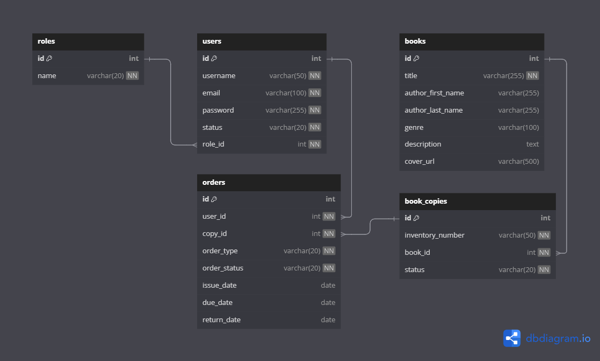

## 📚 Web Application "Library"

### 🚀 Getting Started
Follow these steps to run the **Library Web Application** locally using Apache Tomcat:
1. Prerequisites (Make sure the following tools are installed on your machine):
   - Java 21+ (JDK)
   - Apache Tomcat 10+ (installed locally)
   - Maven 3+
   - PostgreSQL or MySQL (or any RDBMS you configured)
2. Clone the Repository
3. Configure the database:
   - Create a database
   - Update database settings in file `application.properties`.
4. Run the SQL Script:
   - schema.sql (create tables)
   - data.sql (insert user roles)
5. Build the WAR file:
   - `mvn clean package`
   - `.war` file will generate in `target` folder
6. Deploy to Apache Tomcat:
   - copy war file to `<TOMCAT>/webapps/`
   - start Tomcat: `<TOMCAT>/bin/startup.sh` on Linux/macOS and
     `<TOMCAT>\bin\startup.bat` on Windows.
7. Access the Application:
   - Open your browser and go to: `http://localhost:8080/library/`
8. Optional: Run Tests, View Coverage and Javadoc
   - Run Unit Tests with Maven `mvn test`
   - Generate Test Coverage Report (JaCoCo) `mvn jacoco:report`. 
     Open the HTML report at the path: `target/site/jacoco/index.html`
   - Generate Javadoc `mvn javadoc:javadoc`. 
     Open the HTML documentation at the path: `target/site/apidocs/index.html`

---
### 📘 Overview
#### 👤 User Roles in the System:
1. Reader – can search for books and place requests.
2. Librarian – processes book lending and returns.
3. Administrator – manages users and the library catalog.
#### 🔍 Reader Functions:
- Register and log in to the system.
- Browse the book catalog (with filters by title, author, genre, etc.).
- View detailed book information (title, author, description, number of available copies, etc.).
- Submit a book request:
  - For home lending (subscription);
  - For in-library use (reading room).
- View personal order history and statuses (pending, issued, returned, etc.). 
- Cancel an active request (if the book has not yet been issued).
#### 📖 Librarian Functions:
- View the list of book requests submitted by readers.
- Confirm the lending of a book:
  - Indicate the return date and the type of lending (home/in-library).
- Mark a book as returned.
- View the availability of book copies (who borrowed and when).
- View the list of readers and their active requests.
#### ⚙️ Administrator Functions:
- Manage user accounts (librarians and readers):
  - Create, edit, block or delete users.
- Manage the book catalog:
  - Add new books.
  - Edit book details.
  - Add or remove copies of books.
- View reports:
  - General statistics (books issued, active users, etc.).
  - Most requested books.
#### 📚 Book Management:
- Each book may have multiple copies, and each copy must have a unique inventory number.
- A book copy can have one of the following statuses:
  - Available
  - Issued (lent to a reader)
  - Reserved (requested but not yet issued)
---
### 📊 Library Diagram

